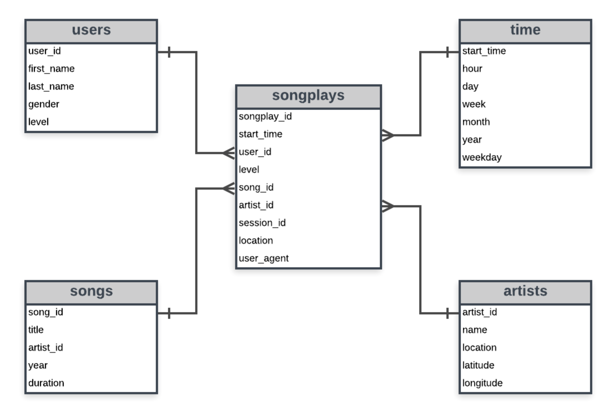
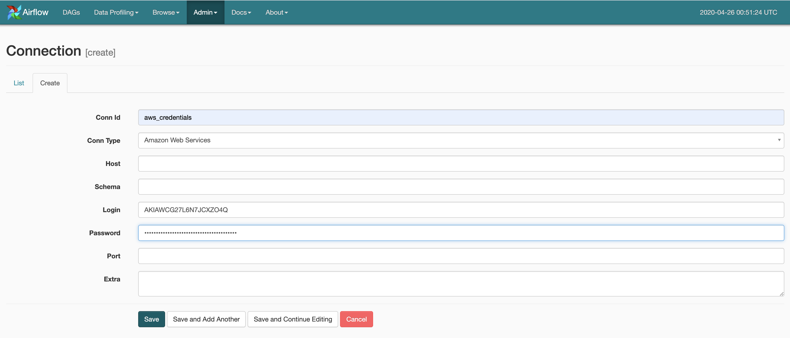
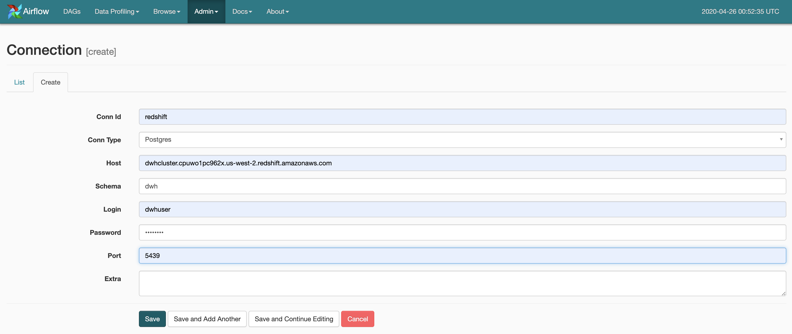
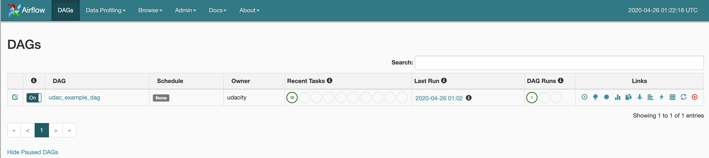
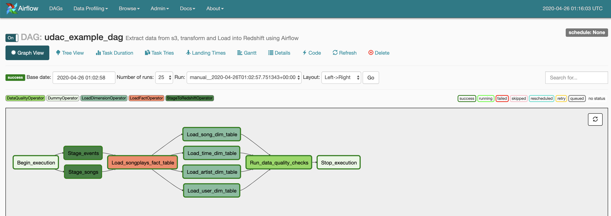
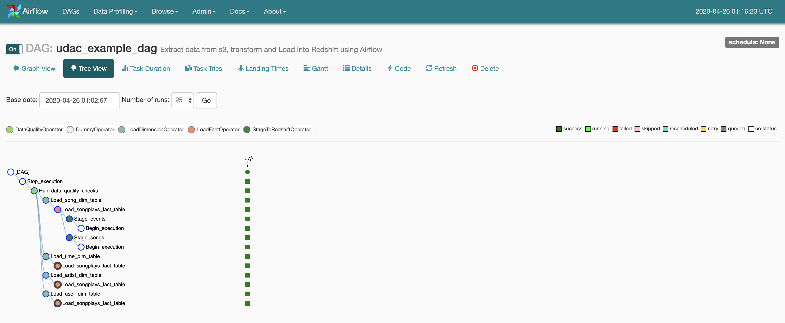
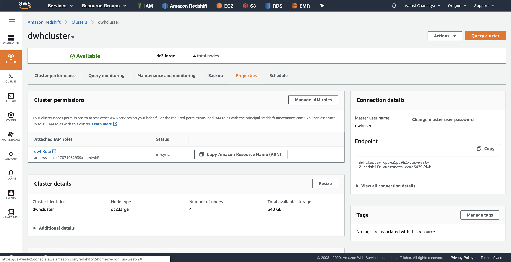
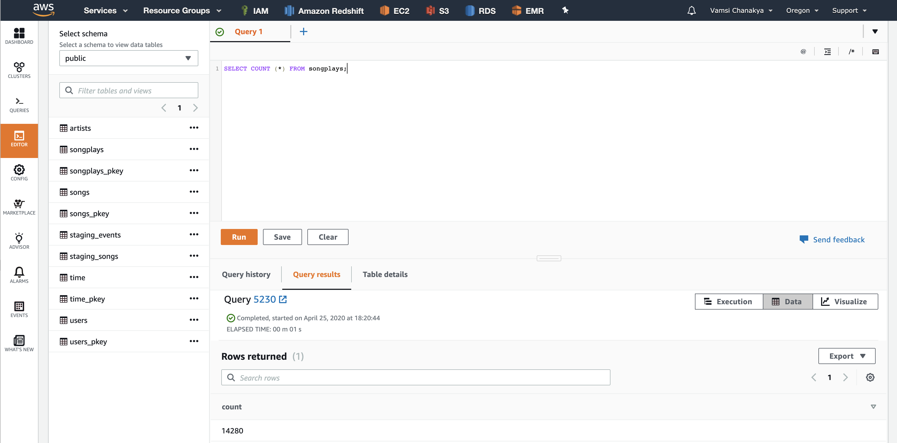

# Project Name - Data Pipeline with AWS S3, Redshift and Airflow 

## Project Purpose
This project is created for a music streaming startup, called sparkify who has decided to introduce more automation and monitoring of their data warehouse ETL pipeline and decided to proceed with Apache Airflow. Sparkify log data and songs data resides in S3, in form of JSON files. As a data engineer we built this ETL pipeline, which extracts their data from s3, process them using spark and load the data back to s3 as a set of dimensional tables, which enables their analytical team to find insights on populat songs and artists etc. 

## Project Description
In this project we are tasked to create high grade data pipelines that are dynamic and build from reusable tasks, which can be monitored and allow easy backfills. We are asked to use Apache Airflow to build ETL pipeline. We load the data from S3, process the data into analytical tables and we load the data to AWS Redshift inform of dimensional tables. 

## Source(s)
In this project, the data is extracted from files which are of JSON file format on s3.

### Song Dataset
Song dataset contains the metadata about a song, i.e details like artist_id, artist_latitude, artist_location, artist_longitude, artist_name, duration, num_songs, song_id, title, year. Song Dataset is partitioned by first 3 letters of each song's track id.

SONG_DATA='s3://udacity-dend/song_data'

### Log Dataset
Log Dataset is generated by event simulator based on songs in song dataset. The data is similar to music streaming app activity log and it contains the below mentioned details. Log dataset contains data like artist, auth, firstName, gender, itemInSession, lastName, length, level, location, method, page, registration, sessionId, song, status, ts, userAgent, userId.

LOG_DATA='s3://udacity-dend/log_data'
LOG_JSONPATH='s3://udacity-dend/log_json_path.json'

##Target(s)
The data extracted from Source JSON files are loaded into a new Redshift database, named as dwh. Using the song and log datasets, a star schema is created which is optimized for queries on song play analysis. This includes the following tables.

###Staging Tables:

staging_events - This staging table contains app activity log information like artist, auth, first_name varchar, gender, item_in_session, last_name, length, level, location, method, page, registration, session_id, song, status, time_stamp, user_agent, user_id

staging_songs  - This staging table contains metadata about songs and respective artists information like num_songs, artist_id, artist_latitude, artist_longitude, artist_location, artist_name, song_id, title, duration, year.

###Star Schema Details : 

Dimension Tables:
users   - users in the app contains user details like user_id, first_name, last_name, gender, level.
songs   - songs in music database contains user details like song_id, title, artist_id, year, duration
artists - artists in music database contains user details like artist_id, name, location, lattitude, longitude
time    - timestamps of records in songplays broken down into specific units, contains user details like start_time, hour, day, week, month, year, weekday

###Fact Table
songplays - records in log data associated with song plays i.e. records with page NextSong,  contains user details like songplay_id, start_time, user_id, level, song_id, artist_id, session_id, location, user_agent

##ETL process :

###Extraction Process :
Step 1: ETL process is comprised of creating 2 staging tables which are staging_events table and staging_songs table
Step 2: In second step we extract the data into staging tables on AWS Redshift from S3 bucket.

###Transformation process:
In this stage we transform staging data of events and songs details into dimension tables users, songs, artists and time.

###Load process :
In this stage we load the Fact Table SongPlays table by consolidating data from dimension tables. 

##Execution Order:
1. Create redshift cluster.
2. Execute create_tables.sql commands
3. Start Apache Airflow webserver
4. In Airflow Web UI, Turn On DAG button
5. As we have specified schedule_interval=None, manually trigger DAG with play button
6. Check the DAG execution and progression of Tasks.
7. After completion of all Tasks of DAG, verify the logs.

##Screenshots
### Connections

###DAG

###AWS RedShift

### Verification

##Statistics
Number of Records Loaded into each table:
number of records in table staging_events are 16,112
number of records in table staging_songs are 29,792
number of records in table users are 104
number of records in table songs are 14,896
number of records in table artists are 10,025
number of records in table time are 14,280
number of records in table songplays are 14,280

##Constraints:
Data Quality of the input datasets should be maintained.
After creating Redshift Cluster we need to wait until it becomes available.
When ever airflow service is restarted make sure the connection variables are created. 

References:
1. https://www.python.org/dev/peps/pep-0008/#introduction
2. https://airflow.apache.org/docs/stable/
3. https://stackoverflow.com/
4. https://docs.aws.amazon.com/redshift/index.html
5. https://docs.aws.amazon.com/IAM/latest/UserGuide/introduction.html